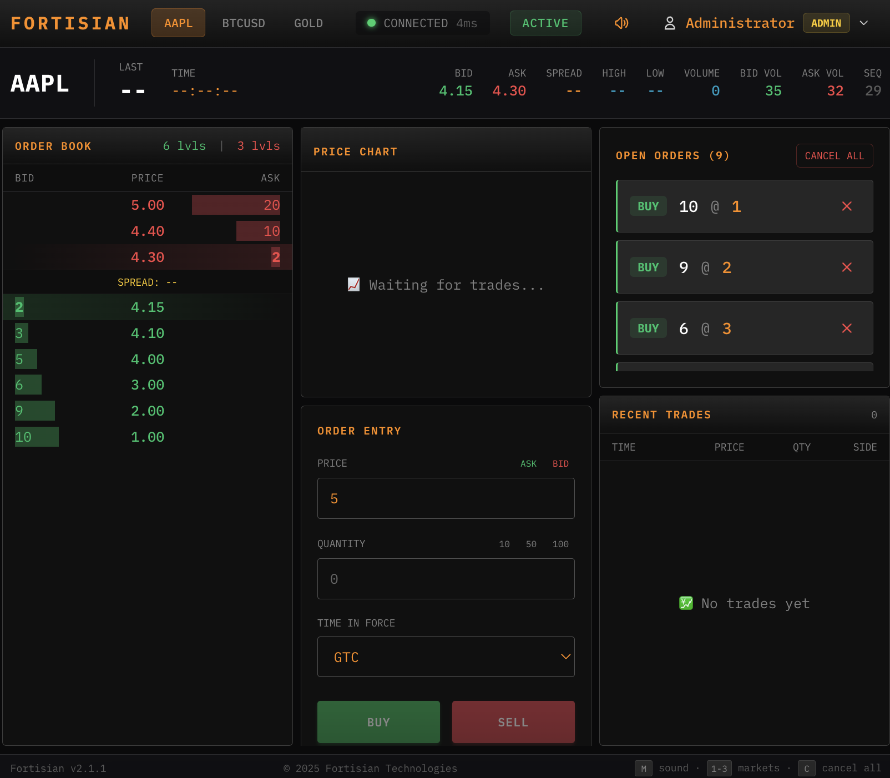

# Fortisian Exchange

A complete trading exchange system with a matching engine and Bloomberg-style frontend interface. Built for educational purposes, classroom trading games, and algorithmic trading simulations.




## Table of Contents

- [Overview](#overview)
- [Architecture](#architecture)
- [Features](#features)
- [Quick Start](#quick-start)
- [Installation](#installation)
- [Configuration](#configuration)
- [API Documentation](#api-documentation)
- [Frontend](#frontend)
- [Backend Components](#backend-components)
- [Deployment](#deployment)
- [Troubleshooting](#troubleshooting)

---

## Overview

Fortisian Exchange is a real-time trading platform that provides:

- **Matching Engine**: Price-time priority order matching with support for multiple markets
- **WebSocket API**: Real-time order submission, book updates, and trade notifications
- **Bloomberg-style UI**: Professional trading interface with order book, position tracking, and analytics
- **Admin Panel**: Comprehensive analytics, user management, and market control
- **Security Features**: Rate limiting, anomaly detection, audit logging, and session management

### Default Markets

The system comes with three pre-configured markets:

| Market | Name | Tick Size | Max Position |
|--------|------|-----------|--------------|
| AAPL | Apple Inc. | 0.01 | 1000 |
| BTCUSD | Bitcoin/USD | 0.01 | 10 |
| GOLD | Gold Futures | 0.10 | 500 |

---

## Architecture

### System Components

```
┌─────────────────────────────────────────────────────────────┐
│                      Frontend (HTML/React)                   │
│  - Trading Interface (fortisian_trading.html)                 │
│  - Admin Panel (fortisian_admin.html)                         │
└──────────────────────┬────────────────────────────────────────┘
                       │ WebSocket + HTTP
┌──────────────────────┴────────────────────────────────────────┐
│                    Backend Server (Python)                     │
│  ┌──────────────────────────────────────────────────────────┐ │
│  │  WebSocket Handler (server.py)                           │ │
│  │  - Session Management                                     │ │
│  │  - Rate Limiting                                          │ │
│  │  - Audit Logging                                         │ │
│  └──────────────┬───────────────────────────────────────────┘ │
│                 │                                               │
│  ┌──────────────┴───────────────────────────────────────────┐ │
│  │  Exchange (exchange.py)                                 │ │
│  │  - Market Management                                      │ │
│  │  - Order Routing                                         │ │
│  └──────────────┬───────────────────────────────────────────┘ │
│                 │                                               │
│  ┌──────────────┴───────────────────────────────────────────┐ │
│  │  Matching Engine (engine.py)                             │ │
│  │  - Price-Time Priority Matching                          │ │
│  │  - Order Book (order_book.py)                           │ │
│  │  - Position Tracking                                     │ │
│  └──────────────────────────────────────────────────────────┘ │
│                                                               │
│  ┌───────────────────────────────────────────────────────────┐ │
│  │  Supporting Modules                                      │ │
│  │  - auth.py: User authentication & sessions               │ │
│  │  - analytics.py: Trade analysis & leaderboards          │ │
│  │  - book_cache.py: Cached book state for fast reads      │ │
│  │  - sweep_orders.py: Multi-level order execution          │ │
│  └──────────────────────────────────────────────────────────┘ │
└───────────────────────────────────────────────────────────────┘
```

### Data Flow

1. **Order Submission**: Client → WebSocket → Exchange → Matching Engine → Order Book
2. **Matching**: Matching Engine finds crosses → Creates Trades → Updates Positions
3. **Event Broadcasting**: Engine emits events → Book Cache updates → WebSocket broadcasts to subscribers
4. **Client Updates**: WebSocket messages → Frontend state updates → UI re-renders

---

## Features

### Trading Features

- **Limit Orders**: Standard limit orders with price-time priority
- **Time-in-Force**: GTC (Good Till Cancel), IOC (Immediate or Cancel), FOK (Fill or Kill)
- **Sweep Orders**: Distribute large orders across multiple price levels
- **Position Tracking**: Real-time P&L, average prices, trade counts
- **Order Book**: Real-time Level 2 market data with depth visualization
- **Trade History**: Complete trade log with price charts

### Security & Anti-Gaming

- **Rate Limiting**: Token bucket algorithm (2 orders/sec, 30/min per user)
- **Anomaly Detection**: Timing pattern analysis to detect bot behavior
- **Session Management**: Secure cookie-based sessions with encryption
- **Audit Logging**: Complete audit trail of all operations
- **User Banning**: Admin can ban users and cancel all their orders
- **Ownership Verification**: Users can only cancel their own orders

### Admin Features

- **User Management**: Create, list, and manage user accounts
- **Market Control**: Start, stop, halt, and resume markets
- **Analytics**: Trade analysis, leaderboards, anomaly detection
- **Audit Logs**: View security events and suspicious activity
- **System Statistics**: Real-time exchange metrics

### Frontend Features

- **Bloomberg-style UI**: Dark theme with professional layout
- **Real-time Updates**: WebSocket-based live data
- **Order Book Visualization**: Color-coded bid/ask levels with volume bars
- **Position Dashboard**: Net position, P&L, trade statistics
- **Price Charts**: Real-time price history with Chart.js
- **Sound Effects**: Audio feedback for trades and fills
- **Keyboard Shortcuts**: Quick order submission
- **Responsive Design**: Works on desktop and tablet

---

## Quick Start

### Prerequisites

- Python 3.12+ (required for type hints)
- Modern web browser (Chrome, Firefox, Safari, Edge)
- Optional: MongoDB 6.0+ (for persistence)

### Start the System

1. **Install dependencies**:
   ```bash
   cd fortisian_backend
   python3 -m venv venv
   source venv/bin/activate  # On Windows: venv\Scripts\activate
   pip install -r requirements.txt
   ```

2. **Start the backend server**:
   ```bash
   python server.py --port 8080
   ```
   
   Note the admin password shown in the console output.

3. **Start the frontend server** (in a new terminal):
   ```bash
   cd fortisian_frontend
   python3 -m http.server 3000
   ```

4. **Open in browser**:
   - Trading UI: `http://localhost:3000/fortisian_trading.html`
   - Admin Panel: `http://localhost:3000/fortisian_admin.html`

5. **Login**:
   - Default admin: `admin` / (password from console)
   - Create additional users via admin panel or `create_users.py`

### Using the Start Script

Alternatively, use the provided start script:

```bash
chmod +x start.sh
./start.sh
```

This starts both backend (port 8080) and frontend (port 3000) servers.

---

## Installation

### Backend Setup

1. **Clone or download the repository**

2. **Create virtual environment**:
   ```bash
   python3 -m venv venv
   source venv/bin/activate
   ```

3. **Install dependencies**:
   ```bash
   pip install -r requirements.txt
   ```

   Dependencies include:
   - `sortedcontainers>=2.4.0` - Efficient sorted data structures for order book
   - `motor>=3.3.0` - Async MongoDB driver (optional)
   - `aiohttp>=3.9.0` - Async HTTP/WebSocket server
   - `aiohttp-session>=2.12.0` - Session middleware
   - `cryptography>=42.0.0` - Encryption for sessions

4. **Create user accounts** (optional):
   ```python
   # create_users.py
   from auth import create_auth_system
   
   user_store, session_manager = create_auth_system(
       storage_path="users.json",
       create_default_admin=True,
       default_admin_password="admin123"
   )
   
   # Create student accounts
   students = [
       ("student1", "pass1234", "Alice"),
       ("student2", "pass5678", "Bob"),
   ]
   
   for user_id, password, display_name in students:
       user_store.create_user(
           user_id=user_id,
           password=password,
           display_name=display_name,
           is_admin=False,
       )
   ```

   Run: `python create_users.py`

### Frontend Setup

The frontend is a single HTML file with embedded React. No build step required.

Simply serve the HTML files via HTTP (not `file://`):

```bash
# Option 1: Python HTTP server
python3 -m http.server 3000

# Option 2: Node.js serve
npm install -g serve
serve -s fortisian_frontend -l 3000
```

---

## Configuration

### Configuration Files

All configuration is now managed through JSON files in the `config/` folder:

- **`config/colors.json`**: Color scheme for the UI (shared by frontend)
- **`config/frontend.json`**: Frontend settings (API URLs, timeouts, etc.)
- **`config/backend.json`**: Backend server settings (ports, rate limits, markets)

The frontend automatically loads `config/colors.json` and `config/frontend.json` from the `fortisian_frontend/config/` folder. The backend loads from `config/backend.json` at the project root.

### Backend Configuration

Edit `config/backend.json` or pass command-line arguments (which override config):

```bash
python server.py \
  --host 0.0.0.0 \
  --port 8080 \
  --admin-token "YourSecretToken"
```

**backend.json structure:**
```json
{
  "server": {
    "host": "0.0.0.0",
    "port": 8080,
    "session_max_age": 86400,
    "allowed_origins": ["*"],
    "require_origin": false
  },
  "rate_limiting": {
    "orders_per_second": 2.0,
    "orders_per_minute": 30,
    "burst": 5
  },
  "anomaly_detection": {
    "window_size": 20,
    "timing_threshold": 0.05
  },
  "book_cache": {
    "requests_per_second": 10.0,
    "requests_burst": 20,
    "max_depth": 50,
    "snapshot_interval": 5.0
  },
  "markets": [
    {
      "market_id": "AAPL",
      "title": "Apple Inc.",
      "description": "Tech giant stock",
      "tick_size": "0.01",
      "max_position": 1000
    }
  ]
}
```

Command-line arguments override config file values.

### Frontend Configuration

Edit `fortisian_frontend/config/frontend.json`:

```json
{
  "api_url": {
    "development": "http://localhost:8080",
    "production": "${window.location.protocol}//${window.location.hostname}:8080"
  },
  "ws_url": {
    "development": "ws://localhost:8080/ws",
    "production": "${window.location.protocol === 'https:' ? 'wss:' : 'ws:'}//${window.location.hostname}:8080/ws"
  },
  "admin_url": "fortisian_admin.html",
  "reconnect_delays": [500, 1000, 2000, 4000, 8000, 15000, 30000],
  "ping_interval": 25000,
  "max_trades": 200,
  "max_price_history": 1000,
  "book_flash_duration": 400,
  "version": "2.1.1"
}
```

Edit `fortisian_frontend/config/colors.json` to customize the color scheme:

```json
{
  "bg": "#0a0a0c",
  "bgDark": "#060608",
  "panel": "#101013",
  "panelHover": "#18181c",
  "border": "#2d2d30",
  "orange": "#ffa028",
  "green": "#00c26a",
  "red": "#f74747",
  ...
}
```

The frontend automatically loads these configs on page load via `config-loader.js`. Configs are loaded asynchronously, so the page will work with defaults if configs are unavailable.

---

## API Documentation

### Authentication

#### POST `/auth/login`

Login and create a session.

**Request**:
```json
{
  "user_id": "admin",
  "password": "password123"
}
```

**Response**:
```json
{
  "success": true,
  "user_id": "admin",
  "display_name": "Administrator",
  "session_id": "abc123...",
  "is_admin": true
}
```

#### POST `/auth/logout`

Logout and invalidate session.

**Response**:
```json
{
  "success": true
}
```

### WebSocket API

Connect to `ws://localhost:8080/ws` after authentication.

#### Client → Server Messages

| Type | Data | Description |
|------|------|-------------|
| `subscribe` | `{market_id}` | Subscribe to market updates |
| `unsubscribe` | `{market_id}` | Unsubscribe from market |
| `order_submit` | `{market_id, side, price, qty, time_in_force, client_order_id}` | Submit new limit order |
| `order_cancel` | `{market_id, order_id}` | Cancel specific order |
| `order_cancel_all` | `{market_id?}` | Cancel all orders (optionally for a market) |
| `get_orders` | `{market_id?}` | Get open orders |
| `get_position` | `{market_id?}` | Get current position |
| `get_book` | `{market_id, depth?}` | Get order book snapshot |
| `get_level2` | `{market_id, depth?}` | Get Level 2 aggregated book |
| `get_bbo` | `{market_id}` | Get best bid/offer (Level 1) |
| `sweep_order` | `{market_id, side, start_price, end_price, qty, allocation}` | Submit sweep order |
| `cancel_sweep` | `{sweep_id}` | Cancel sweep order |
| `ping` | - | Keepalive heartbeat |

**Example Order Submission**:
```json
{
  "type": "order_submit",
  "data": {
    "market_id": "AAPL",
    "side": "buy",
    "price": "100.00",
    "qty": 10,
    "time_in_force": "gtc",
    "client_order_id": "my-order-123"
  },
  "request_id": "req-456"
}
```

#### Server → Client Messages

| Type | Data | Description |
|------|------|-------------|
| `subscribed` | `{market_id}` | Subscription confirmed |
| `unsubscribed` | `{market_id}` | Unsubscription confirmed |
| `order_accepted` | Order details | Your order was accepted |
| `order_rejected` | `{reason, reason_text}` | Your order was rejected |
| `order_filled` | Fill details | Your order was filled (partially or fully) |
| `order_cancelled` | `{order_id}` | Your order was cancelled |
| `order_expired` | `{order_id, reason}` | Your order expired |
| `trade` | Trade details | New trade executed (public info) |
| `book_snapshot` | Full book state | Initial book on subscribe |
| `book_delta` | Changes only | Incremental book updates |
| `market_status` | `{status, market_id}` | Market status changed |
| `orders` | List of orders | Your open orders |
| `position` | Position details | Your current position |
| `pong` | - | Heartbeat response |
| `error` | `{message, code}` | Error occurred |

**Example Trade Message**:
```json
{
  "type": "trade",
  "data": {
    "id": "trade-789",
    "market_id": "AAPL",
    "price": "100.50",
    "qty": 5,
    "aggressor_side": "buy",
    "sequence": 1234,
    "created_at": "2024-01-15T10:30:00Z"
  }
}
```

### Admin REST API

All admin endpoints require authentication (session cookie or `X-Admin-Token` header).

#### GET `/admin/stats`

Get exchange statistics.

**Response**:
```json
{
  "markets": 3,
  "total_orders": 150,
  "total_trades": 1234,
  "connected_users": 5,
  "active_sessions": 5,
  "suspicious_users": [],
  "book_cache": {...},
  "market_stats": {...}
}
```

#### GET `/admin/audit`

Get audit log events.

**Query Parameters**:
- `user_id` (optional): Filter by user
- `event_type` (optional): Filter by event type
- `limit` (optional): Max entries (default: 100)

#### POST `/admin/ban`

Ban a user.

**Request**:
```json
{
  "user_id": "trader1",
  "reason": "Suspicious activity"
}
```

#### POST `/admin/unban`

Unban a user.

**Request**:
```json
{
  "user_id": "trader1"
}
```

#### POST `/admin/market/{action}`

Control market status. Actions: `start`, `stop`, `halt`, `resume`.

**Request**:
```json
{
  "market_id": "AAPL"
}
```

#### POST `/admin/users/create`

Create a new user.

**Request**:
```json
{
  "user_id": "student1",
  "password": "pass1234",
  "display_name": "Alice",
  "is_admin": false,
  "team": "Team Alpha"
}
```

#### POST `/admin/users/bulk_create`

Create multiple users at once.

**Request**:
```json
{
  "users": [
    {"user_id": "student1", "password": "pass1234", "display_name": "Alice"},
    {"user_id": "student2", "password": "pass5678", "display_name": "Bob"}
  ]
}
```

#### GET `/admin/users`

List all users.

**Query Parameters**:
- `include_inactive` (optional): Include inactive users (default: false)

#### GET `/admin/analytics/trades`

Export all trades.

**Query Parameters**:
- `market_id` (optional): Filter by market
- `include_user_ids` (optional): Include user IDs (default: true)

#### GET `/admin/analytics/user/{user_id}`

Get detailed trade analysis for a user.

**Query Parameters**:
- `market_id` (optional): Filter by market

#### GET `/admin/analytics/market/{market_id}`

Get detailed analysis for a market.

#### GET `/admin/analytics/leaderboard`

Get trading leaderboard.

**Query Parameters**:
- `market_id` (optional): Filter by market
- `sort_by` (optional): Sort field (default: `realized_pnl`)
- `limit` (optional): Max entries (default: 100)

#### GET `/admin/analytics/anomalies`

Detect trading anomalies.

#### GET `/health`

Health check endpoint (no auth required).

**Response**:
```json
{
  "status": "healthy",
  "timestamp": "2024-01-15T10:30:00Z",
  "markets": 3,
  "connections": 5
}
```

---

## Frontend

### Trading Interface (`fortisian_trading.html`)

The main trading interface provides:

- **Order Book**: Real-time Level 2 order book with bid/ask depth
- **Order Entry**: Submit buy/sell orders with price, quantity, and TIF
- **Open Orders**: List of your active orders with cancel buttons
- **Position**: Current position, P&L, trade statistics
- **Recent Trades**: Stream of recent trades with price/volume
- **Price Chart**: Real-time price history chart
- **Market Stats**: Day high/low/open, volume, last price

**Keyboard Shortcuts**:
- Click on order book level to set price
- Use number pad for quick quantity entry
- ESC to cancel order form

### Admin Panel (`fortisian_admin.html`)

The admin panel provides:

- **User Management**: Create, list, ban/unban users
- **Market Control**: Start, stop, halt markets
- **Analytics Dashboard**: Trade statistics, leaderboards
- **Audit Log**: Security events and suspicious activity
- **System Monitoring**: Connection counts, rate limits

---

## Backend Components

### Core Matching Engine

**Location**: `fortisian_backend/matching_engine/`

- **`exchange.py`**: Top-level API managing multiple markets
- **`engine.py`**: Single-market matching engine with price-time priority
- **`order_book.py`**: Order book implementation using sorted containers
- **`models.py`**: Domain models (Order, Trade, Market, Position)
- **`events.py`**: Event types emitted by the engine

**Key Features**:
- Price-time priority matching
- Self-trade prevention
- Position tracking with limits
- IOC/FOK order types
- Circuit breakers (price bands)

### Server (`server.py`)

Main WebSocket server with:

- **Session Management**: Cookie-based authentication
- **Rate Limiting**: Token bucket algorithm per user
- **Anomaly Detection**: Timing pattern analysis
- **Audit Logging**: Security event tracking
- **Book Cache**: Cached book state for fast reads
- **Sweep Orders**: Multi-level order execution

### Authentication (`auth.py`)

User management and authentication:

- **Password Hashing**: PBKDF2 with 100k iterations
- **Session Management**: Secure session tokens
- **User Store**: File-based persistence (JSON)
- **Admin Verification**: Role-based access control

### Analytics (`analytics.py`)

Trade analysis and reporting:

- **User Analysis**: Trade statistics per user
- **Market Analysis**: OHLC, VWAP, participation metrics
- **Leaderboard**: P&L rankings
- **Anomaly Detection**: Wash trading, volume spikes
- **Order Flow Analysis**: Time-bucketed trade data

### Book Cache (`book_cache.py`)

Cached order book state:

- **Fast Reads**: Separate cache layer for book queries
- **Rate Limiting**: Per-user rate limits for book requests
- **Real-time Updates**: Event-driven cache updates
- **Level 1/2 Data**: BBO and aggregated depth

### Sweep Orders (`sweep_orders.py`)

Multi-level order execution:

- **Price Range**: Submit orders across price range
- **Allocation Strategies**: Equal, front-weighted, back-weighted
- **Batch Execution**: Multiple orders from single request

---

## Deployment

### Production Setup

1. **Server Requirements**:
   - Ubuntu 22.04+ or Debian 12+
   - 2+ CPU cores, 4GB+ RAM
   - Python 3.12+
   - Optional: MongoDB 7.0+

2. **Install Dependencies**:
   ```bash
   sudo apt update && sudo apt upgrade -y
   sudo apt install -y python3.12 python3.12-venv python3-pip nginx certbot
   ```

3. **Deploy Application**:
   ```bash
   sudo useradd -m -s /bin/bash fortisian
   sudo mkdir -p /opt/fortisian/{backend,frontend,logs}
   sudo chown fortisian:fortisian /opt/fortisian
   
   # Upload files to /opt/fortisian/backend and /opt/fortisian/frontend
   cd /opt/fortisian/backend
   python3.12 -m venv venv
   source venv/bin/activate
   pip install -r requirements.txt
   ```

4. **Create Systemd Service**:
   ```bash
   sudo tee /etc/systemd/system/fortisian.service << 'EOF'
   [Unit]
   Description=Fortisian Trading Exchange
   After=network.target
   
   [Service]
   Type=simple
   User=fortisian
   WorkingDirectory=/opt/fortisian/backend
   Environment=PATH=/opt/fortisian/backend/venv/bin
   ExecStart=/opt/fortisian/backend/venv/bin/python server.py --host 127.0.0.1 --port 8080
   Restart=always
   RestartSec=5
   StandardOutput=append:/opt/fortisian/logs/server.log
   StandardError=append:/opt/fortisian/logs/error.log
   
   [Install]
   WantedBy=multi-user.target
   EOF
   
   sudo systemctl daemon-reload
   sudo systemctl enable fortisian
   sudo systemctl start fortisian
   ```

5. **Configure Nginx**:
   ```nginx
   server {
       listen 443 ssl http2;
       server_name fortisian.com;
       
       ssl_certificate /etc/letsencrypt/live/fortisian.com/fullchain.pem;
       ssl_certificate_key /etc/letsencrypt/live/fortisian.com/privkey.pem;
       
       # Frontend
       root /opt/fortisian/frontend;
       index fortisian_trading.html;
       
       location / {
           try_files $uri $uri/ /fortisian_trading.html;
       }
       
       # API Proxy
       location /api/ {
           proxy_pass http://127.0.0.1:8080/;
           proxy_http_version 1.1;
           proxy_set_header Host $host;
           proxy_set_header X-Real-IP $remote_addr;
           proxy_set_header X-Forwarded-For $proxy_add_x_forwarded_for;
           proxy_set_header X-Forwarded-Proto $scheme;
       }
       
       # WebSockets
       location /ws {
           proxy_pass http://127.0.0.1:8080/ws;
           proxy_http_version 1.1;
           proxy_set_header Upgrade $http_upgrade;
           proxy_set_header Connection "upgrade";
           proxy_read_timeout 86400;
       }
   }
   ```

6. **SSL Certificate**:
   ```bash
   sudo certbot --nginx -d fortisian.com -d www.fortisian.com
   ```

7. **Firewall**:
   ```bash
   sudo ufw allow 22/tcp
   sudo ufw allow 80/tcp
   sudo ufw allow 443/tcp
   sudo ufw enable
   ```

### Security Checklist

- [ ] Change default admin password
- [ ] Use HTTPS (SSL certificate)
- [ ] Configure UFW firewall
- [ ] Set secure session secret
- [ ] Restrict CORS origins (not `*`)
- [ ] Enable MongoDB authentication (if using)
- [ ] Set up log rotation
- [ ] Configure automatic backups
- [ ] Monitor logs regularly

---

## Troubleshooting

### Connection Issues

**"Connection refused" when starting server**:
- Port already in use: `lsof -i :8080`
- Use different port: `python server.py --port 8081`

**"WebSocket connection failed"**:
- Verify server is running: `curl http://localhost:8080/health`
- Check CONFIG values in HTML match server
- Ensure frontend is served via HTTP (not `file://`)
- Check CORS configuration

### Authentication Issues

**"Invalid credentials" on login**:
- Check server console for default admin password
- Verify user exists: Use admin panel or check `users.json`
- Password is case-sensitive

**Sessions breaking**:
- Check cookies are enabled in browser
- Verify `credentials: 'include'` in fetch requests
- Check CORS configuration allows credentials

### Trading Issues

**Orders not matching**:
- Verify market is started (status = `active`)
- Prices must cross: buy price >= sell price
- Check market status: `GET /admin/stats`

**Rate limit errors**:
- Default: 2 orders/sec, 30/min per user
- Adjust in `ServerConfig` if needed
- Check audit log for rate limit events

### Performance Issues

**Slow book updates**:
- Check book cache rate limits
- Verify WebSocket connection is stable
- Check server CPU/memory usage

**High memory usage**:
- Limit trade history size
- Configure book cache max depth
- Consider MongoDB persistence for long-running sessions

### Production Issues

**502 Bad Gateway**:
- Backend not running: `sudo systemctl status fortisian`
- Wrong port in Nginx config
- Check logs: `journalctl -u fortisian -f`

**WebSocket disconnects**:
- Check Nginx proxy timeouts
- Verify `proxy_read_timeout` is set high enough
- Check server logs for errors

---

## Development

### Running Tests

```bash
cd fortisian_backend
pytest
```

### Code Structure

```
fortisian_backend/
├── server.py              # Main WebSocket server
├── auth.py                # Authentication system
├── analytics.py           # Admin analytics
├── book_cache.py          # Book caching layer
├── sweep_orders.py        # Sweep order manager
├── persistence.py         # MongoDB persistence (optional)
├── persistence_memory.py  # In-memory fallback
├── create_users.py        # User creation script
└── matching_engine/
    ├── exchange.py        # Exchange manager
    ├── engine.py          # Matching engine
    ├── order_book.py      # Order book implementation
    ├── models.py          # Domain models
    └── events.py          # Event types

fortisian_frontend/
├── fortisian_trading.html # Main trading interface
├── fortisian_admin.html   # Admin panel
└── demo/                  # Demo pages
```

### Adding New Markets

```python
from matching_engine import Exchange

exchange = Exchange()

exchange.create_market(
    market_id="TSLA",
    title="Tesla Inc.",
    description="Electric vehicle company",
    tick_size="0.01",
    lot_size=1,
    max_position=500,
)

exchange.start_market("TSLA")
```

---

## License

This project is provided for educational purposes.

---

## Support

For issues:
1. Check server console for errors
2. Check browser console (F12) for JavaScript errors
3. Verify WebSocket connection in Network tab
4. Ensure all services are running on correct ports
5. Review audit logs for security events

---

## Quick Reference

```
┌─────────────────────────────────────────────────────────────┐
│                    FORTISIAN EXCHANGE                       │
├─────────────────────────────────────────────────────────────┤
│ Backend:  python server.py --port 8080                      │
│ Frontend: python -m http.server 3000                       │
│                                                             │
│ URLs:                                                       │
│   API:      http://localhost:8080                           │
│   WebSocket: ws://localhost:8080/ws                         │
│   Frontend: http://localhost:3000/fortisian_trading.html    │
│   Admin:    http://localhost:3000/fortisian_admin.html      │
│                                                             │
│ Default Admin:                                              │
│   Username: admin                                           │
│   Password: (shown in server console)                       │
│                                                             │
│ Markets: AAPL, BTCUSD, GOLD                                │
│                                                             │
│ Health Check: curl http://localhost:8080/health             │
└─────────────────────────────────────────────────────────────┘
```
